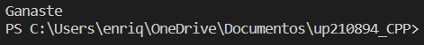

<div align= center>

> # Unit 1 

<div align= justify>

> # Exercise 1: Bisection

<div align= justify>

> ## Code

``` 
    import math as ma

x1 = 1
x2 = 2
xm = None
Es = 0.001 
Er = abs(x2-x1)    
i = 1
it = round((ma.log(x2 - x1) - ma.log(Es)) / ma.log(2))
print('Iterations: ',it)

print('i','x1','x2','Er','xm','f(x1)','f(xm)','f(x1) * f(xm)',sep='\t|')

while (Er >= Es):
        xm = (x1 + x2) / 2
        print (i, round(x1,3),round(x2,3),round(Er,3),round(xm,3),round(((x1 ** 2) - 2),3),round(((xm ** 2) - 2),3), round((round(((x1 ** 2) - 2),3))*(round(((xm ** 2) - 2),3)),3),sep='\t|')
        if (((x1 ** 2) - 2) * ((xm ** 2) - 2) < 0): 
            x2 = xm
        else:
            x1 = xm 
        Er = abs(x2 - x1)
        i = i + 1

print('Root: ',xm)
 ```
<div align= justify>

> ## Evidence

### 1) 


---------------------------------------------------------------

<div align= justify>

> # Exercise 2: Secret number

<div align= justify>

> ## Code

``` 
import os
from random import randrange

numero = 0
secreto = randrange (0, 101 )

menor = 0
mayor = 100
os.system ("cls")

while (numero != secreto):
    print(menor, "<----------->", mayor)

    numero = int(input("Ingresa un número del 1 al 100:  "))
    os.system ("cls")
    if (numero < secreto):
        menor = numero
        print ("Subele")
    elif (numero > secreto):
        mayor = numero
        print ("Bajale")
    else:
        continue

print("Ganaste")
 ```
<div align= justify>

> ## Evidence

### 1) 




---------------------------------------------------------------

<div align= justify>

> # Exercise 3: Ticket

<div align= justify>

> ## Code

``` 
precio = 0
dinero = int (input("Ingresa la cantidad de dinero: "))

while (dinero > precio):
    precio += 1
    dinero -= precio
    
print("Cantidad de boletos: ", precio)
 ```
<div align= justify>

> ## Evidence

### 1) 


---------------------------------------------------------------

<div align= justify>

> # Exercise 4: Bubble Sort

<div align= justify>

> ## Code

``` 
arreglo = [58,45,89,56,34,78,56,43,97,23]
ordenado = False
valormayor = None

while (ordenado == False): 
    ordenado = True
    for i in range(len(arreglo)-1):
        if (arreglo[i] > arreglo[i+1]):
            ordenado = False
            valormayor = arreglo[i]
            arreglo[i] = arreglo[i+1]
            arreglo[i + 1] = valormayor

print('Arreglo: ',arreglo)
 ```
<div align= justify>

> ## Evidence

### 1) 


---------------------------------------------------------------

<div align= justify>

> # Exercise 5: Random Matrix

<div align= justify>

> ## Code

``` 
from random import randrange

diferente = True

tamaño = int(input("Ingrese el tamaño de la matriz cuadrada:  "))
rooms = [[0 for r in range(tamaño)] for f in range(tamaño)]

while (diferente == True):
    numeroaleatorio = randrange (1, tamaño**2 + 1)
    for i in range (len (rooms)):
        for j in range (len (rooms)):
            if (numeroaleatorio == rooms[i][j] or rooms[i][j] == 0):
                rooms [i][j] = numeroaleatorio
                break
            else: 
                continue
        if (rooms[i][j] == numeroaleatorio):
            break

    if (rooms[tamaño-1][tamaño-1] == 0):

        diferente = True
    else :
        diferente = False

print('Matriz aleatoria: ',rooms)
 ```
<div align= justify>

> ## Evidence

### 1) 


---------------------------------------------------------------

<div align= justify>

> # Exercise 6: Palindromo

<div align= justify>

> ## Code

``` 
frente = 0
atras = -1
palindromo = True

palabra = str(input("Ingresa una palabra o frase:  "))

palabra = palabra.lower()
palabra = palabra.replace(" ", "")
palabra = palabra.replace("á", "a")
palabra = palabra.replace("é", "e")
palabra = palabra.replace("í", "i")
palabra = palabra.replace("ó", "o")
palabra = palabra.replace("ú", "u")

longitud = len(palabra)
longitud = longitud//2

while (frente <= longitud):
    if (palabra[frente] == palabra[atras]):
        pass
    else:
        palindromo = False
        break
    frente += 1
    atras -=1

print('La palabra o frace es un palindromo: ',palindromo)
 ```
<div align= justify>

> ## Evidence

### 1) 


